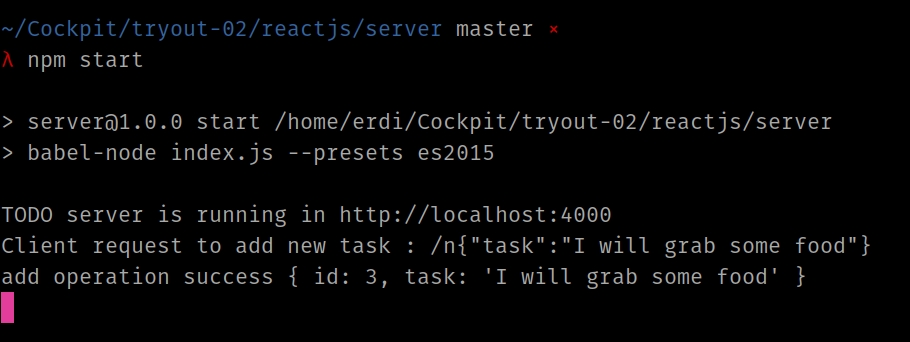
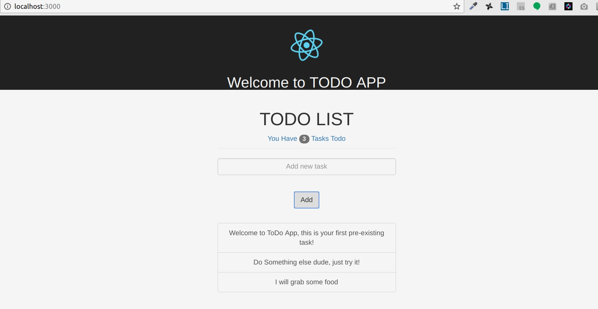

# Refactory - Try Out 02

by : **Erdiansyah**

This repository contains source codes for Refactory's Try Out 02, which includes:

## ReactJS - Todo List

### Description

This application consists of two parts, todo-app and server. To run this application, follow instructions below.

####Server

The server is written in nodejs environment. I used several library in this app:

1. babel-cli and babel-preset-es2015 to enable javascript ES6 syntax
2. express-js as backend middleware to provide webAPI functionality
3. body-parser to handle cross origin issue

this is what the server app would looked like:

    

 

###Client App

The Client is written in reactjs libarary. I also used several library in this app:

1. axios to profide http request functionality
2. bootstrap 3 for styling the app

this is what the client app would looked like:

    

 

### Instruction/ How To Run

**Server**
1. Go to server directory by using `cd ./reactjs/server`
2. If this is your first time run, execute `yarn install`
3. Run the server using `npm start`

**Client**
1. access the client directory by using `cd ./reactjs/todo-app`
2. If this is your first time run, execute `yarn install`
3. Run the client by run `yarn start` it will open new browser to display the app
4. To add new task you can type the task description in the input box
5. To Delete existing Task simply click the desired task

## Native Module

> _Work in progress_

## License

MIT

## Footnote

This repository is maintained by Erdiansyah.

